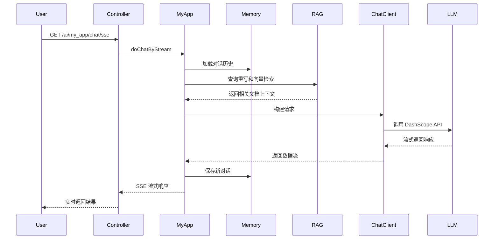
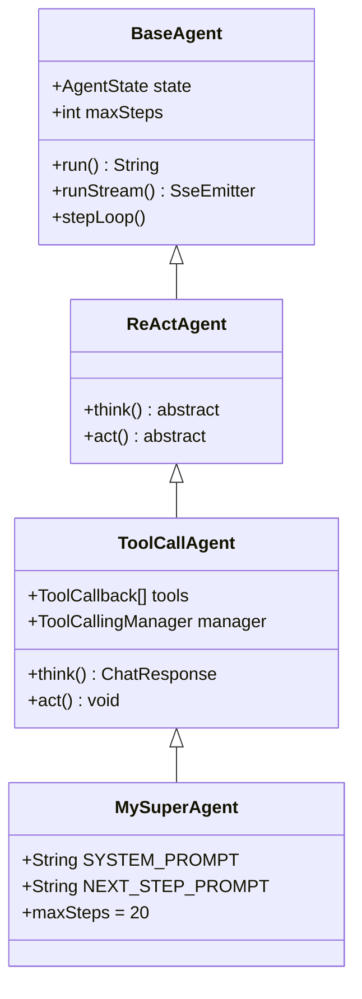
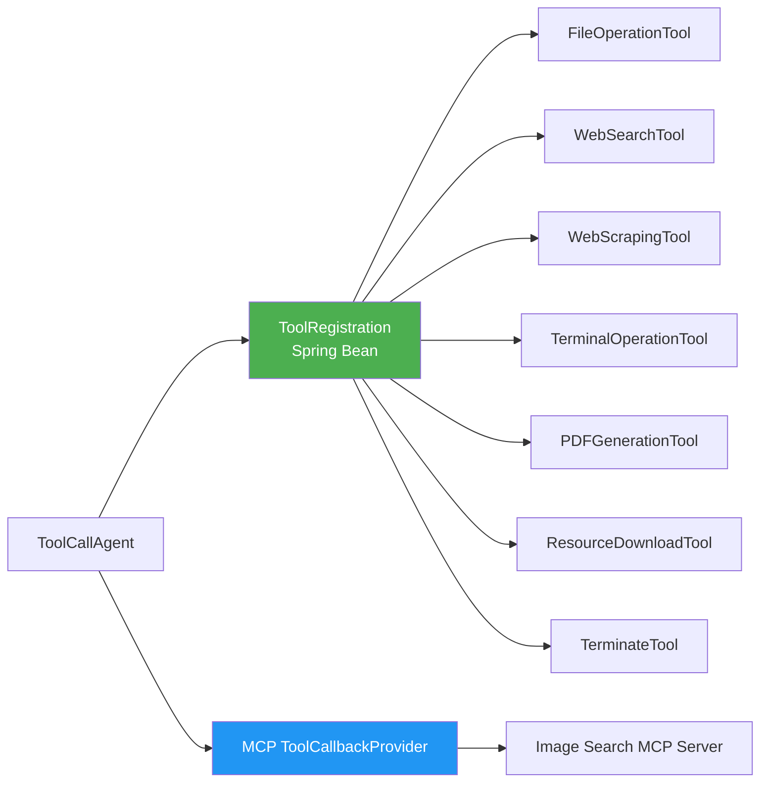
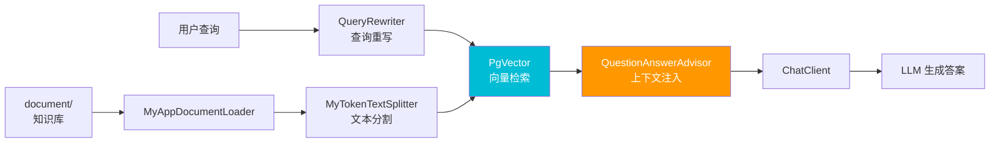
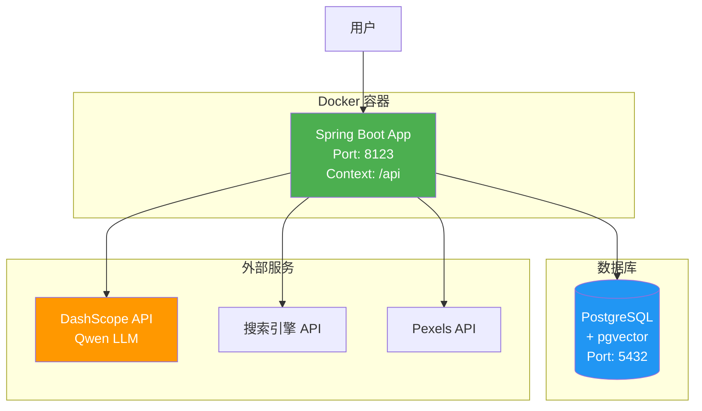

# My AI Agent 架构图

## 系统整体架构

```mermaid
graph TB
    subgraph "客户端层"
        Client[HTTP Client]
        Browser[浏览器/前端]
    end

    subgraph "API 层"
        Controller[AiController<br/>REST API<br/>:8123/api]
    end

    subgraph "应用层"
        MyApp[MyApp<br/>标准聊天应用]
        MySuperAgent[MySuperAgent<br/>自主规划智能体]
    end

    subgraph "Agent 框架层"
        BaseAgent[BaseAgent<br/>状态机 + 步骤循环]
        ReActAgent[ReActAgent<br/>推理 + 行动模式]
        ToolCallAgent[ToolCallAgent<br/>工具调用管理]
    end

    subgraph "工具系统"
        ToolReg[ToolRegistration<br/>工具注册中心]
        FileOp[FileOperationTool<br/>文件操作]
        WebSearch[WebSearchTool<br/>网页搜索]
        WebScrape[WebScrapingTool<br/>网页抓取]
        Terminal[TerminalOperationTool<br/>终端命令]
        PDF[PDFGenerationTool<br/>PDF生成]
        Download[ResourceDownloadTool<br/>资源下载]
        Terminate[TerminateTool<br/>终止工具]
    end

    subgraph "MCP 协议层"
        MCPConfig[mcp-servers.json<br/>MCP服务配置]
        MCPProvider[ToolCallbackProvider<br/>MCP工具加载器]
        MCPServer[my-image-search-mcp-server<br/>图片搜索MCP服务]
    end

    subgraph "RAG 系统"
        VectorStore[PgVector<br/>向量数据库<br/>1536维 HNSW索引]
        DocLoader[MyAppDocumentLoader<br/>文档加载器]
        QueryRewriter[QueryRewriter<br/>查询重写器]
        QAAdvisor[QuestionAnswerAdvisor<br/>RAG上下文注入]
        Docs[document/<br/>知识库文档]
    end

    subgraph "记忆系统"
        FileMemory[FileBasedChatMemory<br/>文件持久化]
        MemoryAdvisor[MessageChatMemoryAdvisor<br/>对话历史管理]
        MemoryFiles[chat-memory/<br/>对话历史JSON]
    end

    subgraph "LLM 层"
        ChatClient[Spring AI ChatClient]
        ChatModel[DashScope ChatModel<br/>Alibaba Qwen]
    end

    subgraph "Advisor 增强层"
        LogAdvisor[MyLoggerAdvisor<br/>日志记录]
        ReReadAdvisor[ReReadingAdvisor<br/>重读优化]
    end

    subgraph "数据层"
        PostgreSQL[(PostgreSQL<br/>+ pgvector扩展)]
    end

    subgraph "外部服务"
        DashScope[阿里云 DashScope API<br/>Qwen大模型]
        SearchAPI[搜索引擎 API]
        PexelsAPI[Pexels 图片 API]
    end

    %% 请求流程
    Client --> Controller
    Browser --> Controller
    Controller --> MyApp
    Controller --> MySuperAgent

    %% MyApp 流程
    MyApp --> ChatClient
    MyApp --> QAAdvisor
    MyApp --> MemoryAdvisor
    MyApp --> MCPProvider

    %% MySuperAgent 继承链
    MySuperAgent -.继承.-> ToolCallAgent
    ToolCallAgent -.继承.-> ReActAgent
    ReActAgent -.继承.-> BaseAgent
    MySuperAgent --> ChatClient

    %% 工具系统连接
    ToolCallAgent --> ToolReg
    ToolReg --> FileOp
    ToolReg --> WebSearch
    ToolReg --> WebScrape
    ToolReg --> Terminal
    ToolReg --> PDF
    ToolReg --> Download
    ToolReg --> Terminate

    %% MCP 连接
    MCPProvider --> MCPConfig
    MCPProvider --> MCPServer
    MCPServer --> PexelsAPI

    %% RAG 流程
    QAAdvisor --> QueryRewriter
    QueryRewriter --> VectorStore
    DocLoader --> Docs
    DocLoader --> VectorStore
    VectorStore --> PostgreSQL

    %% 记忆系统
    MemoryAdvisor --> FileMemory
    FileMemory --> MemoryFiles

    %% ChatClient 连接
    ChatClient --> LogAdvisor
    ChatClient --> ReReadAdvisor
    ChatClient --> ChatModel
    ChatModel --> DashScope

    %% 工具外部调用
    WebSearch --> SearchAPI

    style Client fill:#e1f5ff
    style Browser fill:#e1f5ff
    style Controller fill:#fff4e6
    style MyApp fill:#f3e5f5
    style MySuperAgent fill:#f3e5f5
    style BaseAgent fill:#e8f5e9
    style ReActAgent fill:#e8f5e9
    style ToolCallAgent fill:#e8f5e9
    style ChatModel fill:#ffebee
    style DashScope fill:#ffcdd2
    style PostgreSQL fill:#e0f2f1
    style VectorStore fill:#e0f2f1
```



## 核心流程说明

### 1. 标准聊天流程 (MyApp)

**流程步骤：**

1. 用户发送请求到 `GET /ai/my_app/chat/sse`
2. Controller 调用 MyApp 的 `doChatByStream(message, chatId)`
3. MyApp 从 FileBasedChatMemory 加载最近10条对话历史
4. QueryRewriter 重写用户查询，然后在 PgVector 中进行向量检索
5. 检索到的相关文档上下文通过 QuestionAnswerAdvisor 注入
6. ChatClient 构建完整请求（包含历史记录和RAG上下文）
7. 调用 DashScope API（Qwen大模型）
8. LLM 流式返回响应
9. 响应通过 Flux<String> 返回给 MyApp
10. MyApp 保存新的对话到 FileBasedChatMemory
11. 通过 SSE 流式推送给用户
12. 用户实时接收结果



### 2. 自主智能体流程 (MySuperAgent)

**流程步骤：**

1. 用户发送请求到 `GET /ai/my_superagent/chat`
2. Controller 创建 MySuperAgent 实例并调用 `runStream(message)`
3. MySuperAgent 启动状态机（IDLE → RUNNING）
4. 进入最多20步的循环：
   - **think()**: BaseAgent 调用 MySuperAgent 的推理方法
   - MySuperAgent 调用 LLM 进行决策
   - LLM 返回工具调用决策
   - **act()**: MySuperAgent 执行动作
   - BaseAgent 调用具体工具（FileOp/WebSearch/Terminal等）
   - 工具返回执行结果
   - 通过 SSE 推送步骤结果给用户
   - 如果检测到 TerminateTool 调用，状态变为 FINISHED，结束循环
5. BaseAgent 完成执行
6. 关闭 SSE 连接

## Agent 继承层次



## 工具系统架构



## RAG 数据流



## 部署架构



## 技术栈

### 核心框架
- **Spring Boot**: 3.5.13
- **Java**: 21
- **Spring AI**: 1.0.0-M6/M7
- **spring-ai-alibaba**: 1.0.0-M6.1

### 数据存储
- **PostgreSQL**: 关系型数据库
- **pgvector**: 向量扩展（1536维 HNSW索引）

### LLM 提供商
- **Alibaba DashScope**: Qwen 系列模型

### 工具库
- **Hutool**: 通用工具库
- **iText 9**: PDF生成
- **JSoup**: HTML解析

### 协议支持
- **MCP (Model Context Protocol)**: 外部工具集成

## 配置文件说明

| 文件 | 用途 |
|------|------|
| `application-local.yml` | 本地开发配置（localhost:5432） |
| `application-prod.yml` | 生产环境配置（host.docker.internal:5432） |
| `mcp-servers.json` | MCP服务器配置（API密钥、服务端点） |
| `CLAUDE.md` | Claude Code 项目指南 |

## 端口和路径

- **服务端口**: 8123
- **Context Path**: `/api`
- **Swagger UI**: `http://localhost:8123/api/swagger-ui.html`

### 主要端点

| 端点 | 方法 | 说明 |
|------|------|------|
| `/ai/my_app/chat/sync` | GET | 同步聊天 |
| `/ai/my_app/chat/sse` | GET | SSE流式聊天 |
| `/ai/my_app/chat/server_sent_event` | GET | ServerSentEvent流式聊天 |
| `/ai/my_app/chat/sse_emitter` | GET | SseEmitter流式聊天 |
| `/ai/my_superagent/chat` | GET | 自主智能体（SSE流式） |

## 关键设计模式

1. **状态机模式**: BaseAgent 管理 IDLE → RUNNING → FINISHED/ERROR 状态转换
2. **ReAct模式**: 推理（Reasoning）+ 行动（Acting）循环
3. **Advisor模式**: Spring AI 的请求/响应拦截增强
4. **工具注册模式**: 统一工具管理和动态加载
5. **流式响应**: SSE/SseEmitter 实现实时推送
6. **RAG模式**: 检索增强生成，结合向量数据库提供上下文

## 数据流向

### MyApp 数据流
```
用户请求 → Controller → MyApp → [Memory + RAG + MCP] → ChatClient → LLM → 流式响应 → 用户
```

### MySuperAgent 数据流
```
用户请求 → Controller → MySuperAgent → BaseAgent 循环 → [think → LLM → act → Tools] × N → 用户
```

## 目录结构

```
src/main/java/com/myagent/myaiagent/
├── agent/                      # Agent 实现
│   ├── BaseAgent.java         # 基础状态机
│   ├── ReActAgent.java        # ReAct 模式
│   ├── ToolCallAgent.java     # 工具调用管理
│   └── MySuperAgent.java      # 生产智能体
├── app/                        # 应用层
│   └── MyApp.java             # 标准聊天应用
├── controller/                 # REST 控制器
│   └── AiController.java      # API 端点
├── tools/                      # 工具实现
│   ├── ToolRegistration.java  # 工具注册
│   ├── FileOperationTool.java
│   ├── WebSearchTool.java
│   ├── WebScrapingTool.java
│   ├── TerminalOperationTool.java
│   ├── PDFGenerationTool.java
│   ├── ResourceDownloadTool.java
│   └── TerminateTool.java
├── rag/                        # RAG 系统
│   ├── MyAppVectorStoreConfig.java
│   ├── MyAppDocumentLoader.java
│   ├── QueryRewriter.java
│   └── MyAppRagCustomAdvisorFactory.java
├── chatmemory/                 # 对话记忆
│   └── FileBasedChatMemory.java
├── advisor/                    # Advisor 增强
│   ├── MyLoggerAdvisor.java
│   └── ReReadingAdvisor.java
└── config/                     # 配置
    └── CorsConfig.java

src/main/resources/
├── document/                   # RAG 知识库
├── application-local.yml       # 本地配置
├── application-prod.yml        # 生产配置
└── mcp-servers.json           # MCP 配置

chat-memory/                    # 对话历史持久化
my-image-search-mcp-server/    # MCP 服务器项目
```

## 扩展点

1. **添加新工具**: 在 `tools/` 目录创建新工具类，在 `ToolRegistration` 中注册
2. **添加新 Agent**: 继承 `ToolCallAgent` 或 `ReActAgent`，实现自定义逻辑
3. **添加新 Advisor**: 实现 Spring AI 的 Advisor 接口，增强请求/响应处理
4. **添加新 MCP 服务**: 在 `mcp-servers.json` 中配置，通过 `ToolCallbackProvider` 加载
5. **扩展 RAG**: 添加新的文档加载器、文本分割器或检索策略
