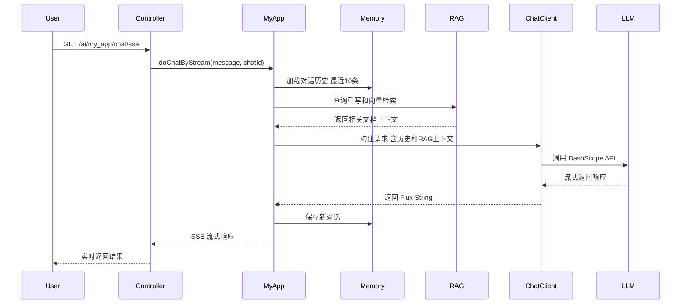
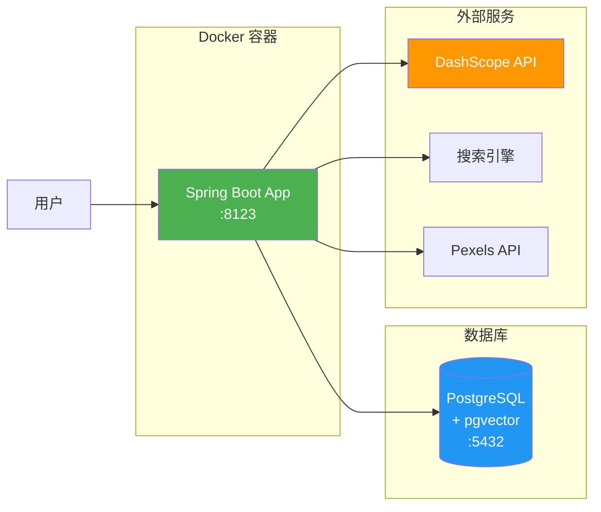

# My AI Agent 架构图

## 系统整体架构

```mermaid
graph TB
    subgraph "客户端层"
        Client[HTTP Client]
        Browser[浏览器/前端]
    end

    subgraph "API 层"
        Controller[AiController<br/>REST API<br/>:8123/api]
    end

    subgraph "应用层"
        MyApp[MyApp<br/>标准聊天应用]
        MySuperAgent[MySuperAgent<br/>自主规划智能体]
    end

    subgraph "Agent 框架层"
        BaseAgent[BaseAgent<br/>状态机 + 步骤循环]
        ReActAgent[ReActAgent<br/>推理 + 行动模式]
        ToolCallAgent[ToolCallAgent<br/>工具调用管理]
    end

    subgraph "工具系统"
        ToolReg[ToolRegistration<br/>工具注册中心]
        FileOp[FileOperationTool<br/>文件操作]
        WebSearch[WebSearchTool<br/>网页搜索]
        WebScrape[WebScrapingTool<br/>网页抓取]
        Terminal[TerminalOperationTool<br/>终端命令]
        PDF[PDFGenerationTool<br/>PDF生成]
        Download[ResourceDownloadTool<br/>资源下载]
        Terminate[TerminateTool<br/>终止工具]
    end

    subgraph "MCP 协议层"
        MCPConfig[mcp-servers.json<br/>MCP服务配置]
        MCPProvider[ToolCallbackProvider<br/>MCP工具加载器]
        MCPServer[my-image-search-mcp-server<br/>图片搜索MCP服务]
    end

    subgraph "RAG 系统"
        VectorStore[PgVector<br/>向量数据库<br/>1536维 HNSW索引]
        DocLoader[MyAppDocumentLoader<br/>文档加载器]
        QueryRewriter[QueryRewriter<br/>查询重写器]
        QAAdvisor[QuestionAnswerAdvisor<br/>RAG上下文注入]
        Docs[document/<br/>知识库文档]
    end

    subgraph "记忆系统"
        FileMemory[FileBasedChatMemory<br/>文件持久化]
        MemoryAdvisor[MessageChatMemoryAdvisor<br/>对话历史管理]
        MemoryFiles[chat-memory/<br/>对话历史JSON]
    end

    subgraph "LLM 层"
        ChatClient[Spring AI ChatClient]
        ChatModel[DashScope ChatModel<br/>Alibaba Qwen]
    end

    subgraph "Advisor 增强层"
        LogAdvisor[MyLoggerAdvisor<br/>日志记录]
        ReReadAdvisor[ReReadingAdvisor<br/>重读优化]
    end

    subgraph "数据层"
        PostgreSQL[(PostgreSQL<br/>+ pgvector扩展)]
    end

    subgraph "外部服务"
        DashScope[阿里云 DashScope API<br/>Qwen大模型]
        SearchAPI[搜索引擎 API]
        PexelsAPI[Pexels 图片 API]
    end

    %% 请求流程
    Client --> Controller
    Browser --> Controller
    Controller --> MyApp
    Controller --> MySuperAgent

    %% MyApp 流程
    MyApp --> ChatClient
    MyApp --> QAAdvisor
    MyApp --> MemoryAdvisor
    MyApp --> MCPProvider

    %% MySuperAgent 继承链
    MySuperAgent -.继承.-> ToolCallAgent
    ToolCallAgent -.继承.-> ReActAgent
    ReActAgent -.继承.-> BaseAgent
    MySuperAgent --> ChatClient

    %% 工具系统连接
    ToolCallAgent --> ToolReg
    ToolReg --> FileOp
    ToolReg --> WebSearch
    ToolReg --> WebScrape
    ToolReg --> Terminal
    ToolReg --> PDF
    ToolReg --> Download
    ToolReg --> Terminate

    %% MCP 连接
    MCPProvider --> MCPConfig
    MCPProvider --> MCPServer
    MCPServer --> PexelsAPI

    %% RAG 流程
    QAAdvisor --> QueryRewriter
    QueryRewriter --> VectorStore
    DocLoader --> Docs
    DocLoader --> VectorStore
    VectorStore --> PostgreSQL

    %% 记忆系统
    MemoryAdvisor --> FileMemory
    FileMemory --> MemoryFiles

    %% ChatClient 连接
    ChatClient --> LogAdvisor
    ChatClient --> ReReadAdvisor
    ChatClient --> ChatModel
    ChatModel --> DashScope

    %% 工具外部调用
    WebSearch --> SearchAPI

    style Client fill:#e1f5ff
    style Browser fill:#e1f5ff
    style Controller fill:#fff4e6
    style MyApp fill:#f3e5f5
    style MySuperAgent fill:#f3e5f5
    style BaseAgent fill:#e8f5e9
    style ReActAgent fill:#e8f5e9
    style ToolCallAgent fill:#e8f5e9
    style ChatModel fill:#ffebee
    style DashScope fill:#ffcdd2
    style PostgreSQL fill:#e0f2f1
    style VectorStore fill:#e0f2f1
```



## 核心流程说明

### 1. 标准聊天流程 (MyApp)


### 2. 自主智能体流程 (MySuperAgent)
```mermaid
sequenceDiagram
    participant User
    participant Controller
    participant MySuperAgent
    participant BaseAgent
    participant LLM
    participant Tools

    User->>Controller: GET /ai/my_superagent/chat
    Controller->>MySuperAgent: runStream(message)
    MySuperAgent->>BaseAgent: 启动状态机 IDLE to RUNNING
    
    loop 最多20步
        BaseAgent->>MySuperAgent: think() 推理下一步
        MySuperAgent->>LLM: 调用大模型决策
        LLM-->>MySuperAgent: 返回工具调用决策
        MySuperAgent->>BaseAgent: act() 执行动作
        BaseAgent->>Tools: 调用具体工具
        Tools-->>BaseAgent: 返回执行结果
        BaseAgent-->>User: SSE推送步骤结果
        
        alt 检测到 TerminateTool
            BaseAgent->>BaseAgent: 状态变为FINISHED
            break 结束循环
        end
    end
    
    BaseAgent-->>Controller: 完成执行
    Controller-->>User: 关闭SSE连接
```

## 技术栈

### 核心框架
- **Spring Boot**: 3.5.13
- **Java**: 21
- **Spring AI**: 1.0.0-M6/M7
- **spring-ai-alibaba**: 1.0.0-M6.1

### 数据存储
- **PostgreSQL**: 关系型数据库
- **pgvector**: 向量扩展(1536维 HNSW索引)

### LLM 提供商
- **Alibaba DashScope**: Qwen 系列模型

### 工具库
- **Hutool**: 通用工具库
- **iText 9**: PDF生成
- **JSoup**: HTML解析

### 协议支持
- **MCP (Model Context Protocol)**: 外部工具集成

## 部署架构



## 配置文件说明

| 文件 | 用途 |
|------|------|
| `application-local.yml` | 本地开发配置(localhost:5432) |
| `application-prod.yml` | 生产环境配置(host.docker.internal:5432) |
| `mcp-servers.json` | MCP服务器配置(API密钥、服务端点) |
| `CLAUDE.md` | Claude Code 项目指南 |

## 端口和路径

- **服务端口**: 8123
- **Context Path**: `/api`
- **Swagger UI**: `http://localhost:8123/api/swagger-ui.html`
- **主要端点**:
  - `/ai/my_app/chat/sync` - 同步聊天
  - `/ai/my_app/chat/sse` - SSE流式聊天
  - `/ai/my_superagent/chat` - 自主智能体

## 关键设计模式

1. **状态机模式**: BaseAgent 管理 IDLE → RUNNING → FINISHED/ERROR 状态转换
2. **ReAct模式**: 推理(Reasoning) + 行动(Acting)循环
3. **Advisor模式**: Spring AI 的请求/响应拦截增强
4. **工具注册模式**: 统一工具管理和动态加载
5. **流式响应**: SSE/SseEmitter 实现实时推送
